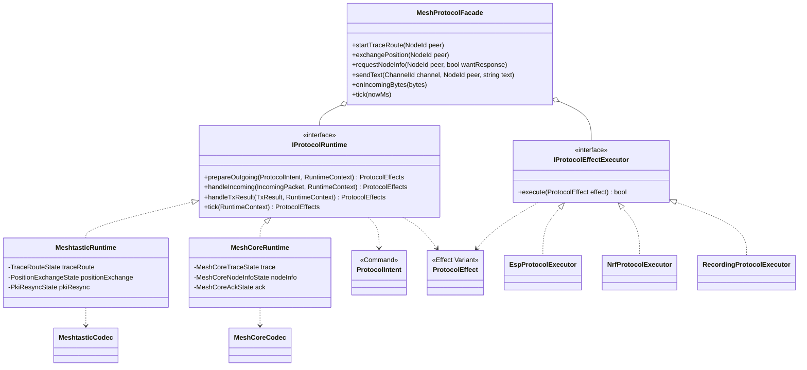
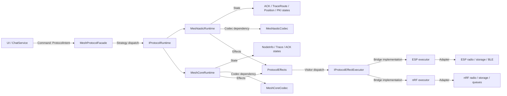
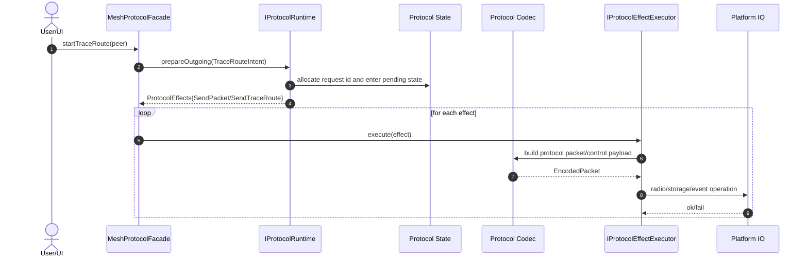
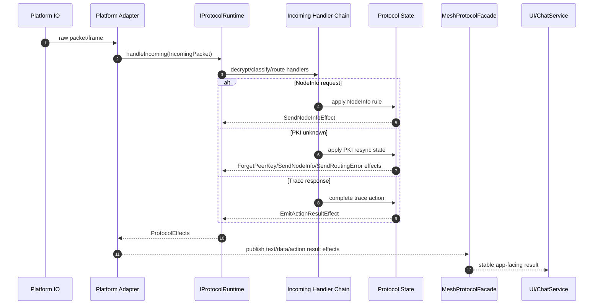
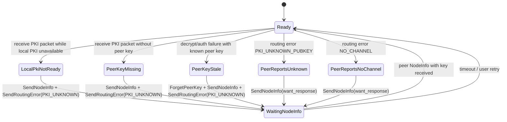
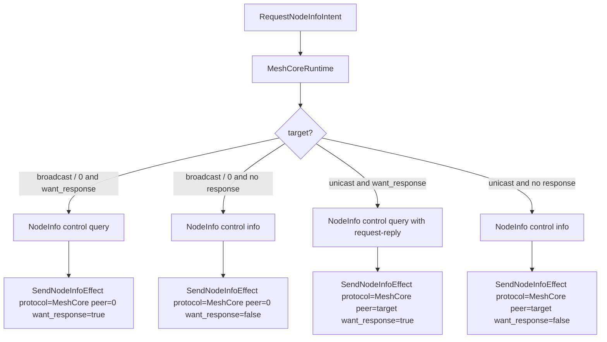

# Protocol Runtime Design Specification

Status date: 2026-06-14

本文档定义 Trail Mate 在多平台、多协议环境下共享协议细节的设计。它补充
`PROTOCOL_ADAPTER_PARITY_SPEC.md`：后者说明“哪些协议行为必须一致”，本文说明“用什么
结构保证一致”。

本文采用 Mermaid 图表达 UML 语义。参考的表达习惯来自
`C:\Users\vicliu\Projects\etc-business\ui-layer\app-backend\docs` 中的时序图文档：先解释
图例，再将类、关系和时序放进 Markdown，便于和代码一起演进。

## Problem Statement

当前 ESP32 和 nRF 的协议 adapter 里混合了四类东西：

- 协议语义：NodeInfo 何时回复、TraceRoute 如何完成、PKI 缺钥如何 resync；
- 协议编解码：Meshtastic protobuf / wire packet，MeshCore frame / control payload；
- 平台执行：radio IO、BLE、storage、clock、queue、board power；
- 产品投影：UI 弹窗、聊天列表、节点列表、诊断日志。

这种混合导致 ESP32 和 nRF 会各自长出“相似但不完全相同”的协议实现。风险不是代码重复本身，
而是协议真相被分散到多个平台 adapter 里，后续任何 bugfix 都依赖人工同步。

目标结构必须让：

- 用户动作以 `ProtocolIntent` 表达；
- 协议真相由共享 `IProtocolRuntime` 解释；
- runtime 只输出 `ProtocolEffect`，不直接访问硬件；
- 平台差异由 `IProtocolEffectExecutor` 执行；
- UI / ChatService 不再知道 protocol portnum、payload type、request id、routing error 细节；
- ESP32 / nRF adapter 不再独立决定协议业务规则。

## UML Notation

| 图中写法 | UML 含义 | 本规格中的解释 |
| --- | --- | --- |
| `classDiagram` | 类图 | 表达接口、实现、组合、依赖和模式结构 |
| `<|..` | Realization | 类实现接口，例如 `MeshtasticRuntime` 实现 `IProtocolRuntime` |
| `*--` | Composition | 强拥有关系，例如 runtime 拥有内部状态机 |
| `o--` | Aggregation | 聚合或注入关系，例如 facade 持有 runtime 引用 |
| `..>` | Dependency | 依赖某个类型，例如 runtime 返回 effects |
| `flowchart` | 关系/管线图 | 表达 Intent -> Runtime -> Effects -> Executor 主轴 |
| `sequenceDiagram` | 时序图 | 表达一次用户动作或一次 incoming packet 的调用顺序 |
| `alt / opt / loop` | UML 组合片段 | 表达互斥分支、可选动作和重复 tick |

## Pattern Decision

本文只采用少数 GoF 23 设计模式作为主轴，避免“模式堆砌”。

### Language Baseline

目标方向是现代 C++，长期可以提升到 C++20；但当前 ESP32 / nRF52 的 PlatformIO
工具链不能同时稳定接受 `-std=gnu++20`：

- ESP32S3 当前 xtensa GCC 8.4 只支持早期 `gnu++2a`；
- nRF52 当前 arm-none-eabi GCC 7.2 不支持 `gnu++20`。

因此当前共享协议 runtime 的最低落地基线定为 **C++17**。构建系统必须去掉 Arduino
默认追加的 `-std=gnu++11`，确保 `std::variant`、`std::visit`、`if constexpr` 等 C++17
能力在 ESP32 和 nRF52 编译单元中都可用。等 nRF 工具链升级后，再将 baseline 提升到
C++20，并考虑引入 concepts / `std::span` / 更强类型约束。

### Primary Patterns

| Pattern | 用在何处 | 解决的问题 | 不变量 |
| --- | --- | --- | --- |
| Strategy | `IProtocolRuntime` 的 `MeshtasticRuntime` / `MeshCoreRuntime` | 同一个 Intent 在不同协议下有不同解释 | UI 和 platform adapter 不得用 `if protocol == ...` 自行解释协议 |
| Command | `ProtocolIntent` | UI / usecase 发出用户意图，而不是 portnum/payload | Intent 表示“要做什么”，不表示“无线包怎么长” |
| State | ACK、TraceRoute、Position、PKI resync 等 runtime 内部状态机 | 跨时间协议会话不再散落在 UI 和 adapter 的 if 分支中 | 状态迁移必须由 runtime 统一拥有 |
| Bridge | `IProtocolRuntime` 输出 `ProtocolEffect`，平台 `IProtocolEffectExecutor` 执行 | 协议语义和平台执行分离，避免 `protocol x platform` 爆炸 | runtime 不调用 radio/storage/BLE；executor 不决定协议语义 |
| Adapter | radio IO、storage、BLE、legacy `IMeshAdapter` 兼容层 | 对接现有平台 API 和 SDK | Adapter 只能适配技术接口，不能承载协议业务规则 |

### Supporting Patterns

| Pattern | 用在何处 | 使用边界 |
| --- | --- | --- |
| Visitor | `std::variant<ProtocolEffect...>` + `std::visit` 的 effect dispatch | 只用于 executor/test 处理 effects，不扩散到 UI |
| Chain of Responsibility | incoming packet 分类管线：decrypt -> routing -> nodeinfo -> position -> trace -> text/appdata | handler 顺序必须写进 runtime 或 spec，不能形成隐式吞包黑洞 |
| Facade | `MeshProtocolFacade` 给 UI/ChatService 的入口 | 只做用例门面，不沉淀协议语义 |
| Abstract Factory / Factory Method | product composition 选择 runtime + executor + codec | 用静态对象/引用也可以，不强制动态分配 |
| Builder | packet/control payload 构造 | 局部用于 codec/build request，不能替代 runtime |

### Patterns To Avoid As Main Axis

| Pattern | 不作为主轴的原因 |
| --- | --- |
| Singleton | 协议 runtime / executor 应通过组合注入，避免全局状态污染测试和多实例 |
| Template Method | 容易把平台差异塞回基类大泥球，不适合作为协议-平台分离主轴 |
| Mediator | 若做成“大协调器”，会替代 runtime 成为新的 God Object |
| Decorator / Proxy / Flyweight / Composite / Prototype | 当前问题不是对象包装、代理、共享小对象、树结构或原型复制 |
| Interpreter | 当前没有脚本化协议规则需求 |
| Memento | 仅在未来持久化 pending action / retransmit state 时考虑 |
| Iterator | 普通容器遍历足够 |
| Observer | 可继续用于事件通知，但它不能解决协议规则分裂 |

## Core Distinctions

### Intent

Intent 是用户或用例层想完成的动作：

- `SendTextIntent`
- `RequestNodeInfoIntent`
- `TraceRouteIntent`
- `ExchangePositionIntent`
- `StartKeyVerificationIntent`
- `SendSelfAnnouncementIntent`

Intent 不包含 Meshtastic portnum、MeshCore payload type、wire channel hash、protobuf bytes 或 request id
分配规则。

### Runtime

Runtime 是协议真相所在：

- `MeshtasticRuntime` 解释 Meshtastic Intent、incoming packet、routing result、tick；
- `MeshCoreRuntime` 解释 MeshCore Intent、incoming frame、trace path、NodeInfo control、tick；
- runtime 可以拥有 State，但不能拥有平台 IO。

### Effect

Effect 是 runtime 要求外部世界发生的动作：

- `SendPacketEffect`
- `SendNodeInfoEffect`
- `SendRoutingErrorEffect`
- `SendTraceRouteEffect`
- `ForgetPeerKeyEffect`
- `RequestPeerNodeInfoEffect`
- `PublishIncomingTextEffect`
- `PublishIncomingDataEffect`
- `PublishNodeInfoEffect`
- `EmitActionResultEffect`
- `UpdatePeerRouteEffect`

Effect 是 runtime 和 executor 的桥。Effect 可以被记录、测试、重放或由不同平台执行。

### Executor

Executor 是平台执行者：

- ESP32 executor 调用 ESP radio/storage/BLE/event bus；
- nRF executor 调用 nRF radio/storage/mono UI app queues；
- test executor 记录 effects。

Executor 不得决定“该不该回复 NodeInfo”“该不该忘掉 PKI key”。它只执行 runtime 给出的 effects。

### Codec

Codec 只负责编解码：

- `MeshtasticCodec`：protobuf/wire packet/Data/Routing/RouteDiscovery；
- `MeshCoreCodec`：frame/header/direct data/group data/control/trace；
- codec 可以使用 Builder 风格的 build request，但不得保存业务状态。

## Primary Class Model

## Pattern Relationship Map

## Runtime Call Flow

### Outgoing User Action

### Incoming Packet

## Meshtastic Runtime Responsibilities

`MeshtasticRuntime` owns:

- app-data destination / ACK / response intent;
- NodeInfo request/reply/reannounce;
- Position request/reply/correlation;
- TraceRoute request/reply/result state;
- routing ACK/error interpretation;
- PKI unknown / stale-key / decrypt-fail resync state;
- duplicate-sensitive packet handling order.

It does not own:

- radio TX/RX calls;
- platform key-value storage;
- OLED/e-paper UI;
- BLE phone protocol transport;
- memory placement or ISR details.

Current C++17 migration state:

- Meshtastic TraceRoute and Position Exchange outgoing user actions can now enter
  `MeshtasticRuntime::prepareOutgoing(...)` as `TraceRouteIntent` / `ExchangePositionIntent`.
  The runtime chooses Meshtastic portnum, request id fallback, ACK/response flags, and protobuf payload shape,
  then emits `SendPacketEffect`.
- Meshtastic direct position sharing can enter the runtime as `SharePositionIntent`; the runtime delegates
  payload construction to `MeshtasticPositionCore`, selects `POSITION_APP`, and emits `SendPacketEffect`.
- nRF mono UI keeps a long-lived `MeshtasticRuntime`, executes `SendPacketEffect`s through
  `MeshAdapterProtocolEffectExecutor`, and feeds incoming packet / TX failure / tick events back into
  the runtime. TraceRoute and Position Exchange lifecycle state is owned by the runtime; UI only projects
  `EmitActionResultEffect` into logs/popups and no longer constructs `TRACEROUTE_APP` / `POSITION_APP`
  packets directly.
- Linux uConsole chat position sharing also uses `SharePositionIntent` and no longer constructs
  Meshtastic Position protobuf or portnum directly.
- Linux uConsole POI sharing uses `ShareWaypointIntent`; the runtime delegates payload construction to
  `MeshtasticWaypointCore`, selects `WAYPOINT_APP`, and emits `SendPacketEffect`.
- Linux uConsole also executes runtime packet effects through `MeshAdapterProtocolEffectExecutor`, so the
  workspace model no longer reads protocol portnum fields directly.
- Platform adapters still own physical radio send, local GPS source selection, BLE projection, queueing, and
  adapter-side incoming packet execution until those can be represented as runtime effects/state.

### Meshtastic PKI Resync State

PKI resync must be a State object, not scattered if branches.

Required effects:

| Input | Effects |
| --- | --- |
| Local PKI not ready | `SendNodeInfo(peer, wantResponse=true)`, `SendRoutingError(peer, request, PKI_UNKNOWN_PUBKEY)` |
| Peer key missing | `SendNodeInfo(peer, wantResponse=true)`, `SendRoutingError(peer, request, PKI_UNKNOWN_PUBKEY)` |
| Peer key stale/decrypt fail | `ForgetPeerKey(peer)`, `SendNodeInfo(peer, wantResponse=true)`, `SendRoutingError(peer, request, PKI_UNKNOWN_PUBKEY)` |
| Peer routing error `PKI_UNKNOWN_PUBKEY` | `SendNodeInfo(peer, wantResponse=true)` |
| Peer routing error `NO_CHANNEL` | `SendNodeInfo(peer, wantResponse=true)` |

The executor chooses how to perform those effects on ESP32/nRF. Runtime decides that they must happen.

## MeshCore Runtime Responsibilities

`MeshCoreRuntime` owns:

- MeshCore NodeInfo query/info control frame semantics;
- MeshCore discover request/response rules;
- MeshCore trace action lifecycle: pending -> delivered -> completed / failed / timed out;
- MeshCore app ACK lifecycle: pending -> completed / failed / timed out;
- route/identity policy when the platform declares support.

Current C++17 migration state:

- Direct-route send decision for ESP32 MeshCore direct text/app-data now uses shared
  `MeshCoreDirectRoutePolicy`: missing peer pubkey triggers discover/failure, selected routes use direct path,
  and route/channel fallback remains explicit without redefining direct-secret material.
- ESP32 MeshCore direct text/app-data no longer fires missing-key discover through an adapter-local send shortcut;
  it enters `DiscoverIntent -> MeshCoreRuntime -> SendDiscoverRequestEffect`, then the adapter executes the effect.
- Incoming MeshCore discover request/response control payloads now flow through `MeshCoreRuntime`: filter/since
  matching emits `SendDiscoverResponseEffect`, and discover responses emit `PublishNodeInfoEffect` plus
  `UpdatePeerRouteEffect`.
- MeshCore identity shared-secret expansion and nRF peer-key derivation now use shared
  `MeshCoreDirectSecretCore`; ESP32 still owns private-key storage and route pubkey lookup before delegating
  key expansion to the runtime helper.
- ESP32 no longer falls back to the historical group-secret-derived direct key; MeshCore direct secrets are
  identity/pubkey-derived only.
- Peer route storage, pubkey persistence, private identity storage, response scheduling, and frame transmission
  are still platform adapter responsibilities until they can be represented as runtime state/effects.

It does not pretend MeshCore is Meshtastic:

- no Meshtastic `TRACEROUTE_APP` for MeshCore trace;
- no Meshtastic `NODEINFO_APP` for MeshCore NodeInfo;
- no Meshtastic PKI assumptions for MeshCore identity/direct secrets.

### MeshCore NodeInfo Command Mapping

nRF must not silently degrade `requestNodeInfo(dest, want_response)` into `sendAdvert(true)` once it claims
NodeInfo support. If nRF lacks a required route/identity capability, it must return unsupported or emit a
capability failure effect.

MeshCore NodeInfo control payload layout is shared codec territory, not platform adapter territory:

- portnum: `4`;
- prefix: `TM`;
- kind: `0x01`;
- query type: `0x01`, optional request-reply flag `0x01`;
- info type: `0x02`, followed by role, hops, node id, timestamp, 10-byte short name, 32-byte long name.

ESP32 and nRF may differ in how they route the resulting `SendNodeInfoEffect`, but they must use the same
codec and the same query/info decision table.

### MeshCore Trace

MeshCore trace must be represented as native MeshCore trace:

- outgoing: `TraceRouteIntent(peer)` -> MeshCore trace state -> `SendTraceRouteEffect`;
- executor resolves the platform route into MeshCore path-hash bytes and sends native `PAYLOAD_TYPE_TRACE`;
- incoming: trace packet handler accumulates path/SNR at the MeshCore frame layer, then reports terminal trace
  payloads back into runtime;
- UI consumes `EmitActionResultEffect`, not raw trace payloads.

Current C++17 migration state:

- trace base payload (`tag`, `auth`, `flags`) is built by shared MeshCore codec;
- target route hashes are appended after the 9-byte base payload. The frame `path` field is not the target route;
  it is the SNR/path trail accumulated while the trace packet is forwarded;
- trace payload decode decides `terminal`, `path_hash_size`, `offset`, `next_hash`, and trace hash slice in
  shared MeshCore codec;
- runtime decides whether the local pending trace is delivered, completed, failed, or timed out;
- ESP32 still owns the concrete relay scheduling and BLE `TraceData` event projection;
- nRF may use a minimal one-hop hash route when no route table exists, but it may not redefine completion policy.

### MeshCore App ACK

MeshCore app ACK has two different responsibilities:

- runtime responsibility: remember pending ACK signatures, bind an ACK signature to a local chat message id, match an
  incoming ACK, evict/timeout pending ACKs, and emit `EmitActionResultEffect`;
- adapter responsibility: compute the on-air packet signature from the encoded frame, transmit ACK frames, project
  completed ACKs into ESP BLE / EventBus events, and apply platform route penalties after timeout.

This split intentionally leaves direct ACK burst scheduling and multi-ACK frame construction in the adapter. Those are
radio execution details. The question "is this local send still pending, completed, failed, or timed out" belongs to
`MeshCoreRuntime`.

## Migration Rules

1. Add shared contracts first: Intent, Effect, Runtime, Executor.
2. Add test-only `RecordingProtocolExecutor` to prove effects are inspectable.
3. Move one state machine at a time:
   - Meshtastic PKI resync;
   - Meshtastic TraceRoute/Position action lifecycle;
   - Meshtastic NodeInfo/Position reply packet construction;
   - MeshCore NodeInfo control payload build/parse;
   - MeshCore trace action lifecycle.
4. Replace adapter logic with `executeEffect(...)` calls only after the shared state test exists.
5. Update `MeshCapabilities` when a protocol action becomes truly shared and executable.
6. Keep existing helper functions only as codec/building utilities, not as orchestration owners.

## Review Checklist

Before changing protocol code:

1. Identify whether the change is Intent, Runtime, Effect, Executor, Codec, or UI projection.
2. Name the GoF pattern involved and why it is being used.
3. If changing a platform adapter, verify the change is only executor/adapter work.
4. If changing protocol semantics, put the rule in shared runtime and add a shared test.
5. Update this spec when the pattern boundary changes.
6. Update `PROTOCOL_ADAPTER_DRIFT_AUDIT.md` when a drift item is resolved or accepted.
7. Run GitNexus impact analysis before edits and `detect-changes` before commit.

## Relationship To Other Specs

- `PROTOCOL_ADAPTER_PARITY_SPEC.md` defines required cross-platform protocol behavior.
- `PROTOCOL_ADAPTER_DRIFT_AUDIT.md` records current drift and migration status.
- `NODE_ACTION_PROTOCOL_SPEC.md` defines user-facing legality of node actions.
- This document defines the design-pattern architecture used to remove drift.
