# UI / Storage / Event Runtime Design Spec

Status date: 2026-06-14

This document defines the design baseline for removing UI stalls caused by
blocking storage, shared-SPI contention, synchronous persistence, and page-owned
runtime side effects.

It complements `RUNTIME_CONCURRENCY_SPEC.md`. The concurrency spec states the
rules. This document explains the design that makes those rules implementable
and testable.

## Problem Statement

Trail Mate currently has several paths where renderer-owned code, runtime
services, and platform storage operations can enter the same slow resource path:

- LVGL timers and page callbacks can trigger SD or shared-SPI access.
- Map tile loading can perform file lookup, image object setup, and decode work
  from the UI owner context.
- GPS track recording can hold recorder state and shared-SPI access while it
  opens, writes, flushes, and closes files.
- Node and contact persistence can be reached from event dispatch paths.
- Feedback notices, protocol completion, and UI mutation can be coupled to the
  page that happened to start an operation.

The failure mode is not only a crash. A target can keep GPS, radio, timers, and
sleep tasks alive while the UI owner task is blocked or starved. When that
happens, touch input, key input, page navigation, display refresh, and wake
handling appear frozen even though background logs continue.

The design goal is therefore:

```text
UI owner context never waits for storage, shared-SPI, filesystem, decode,
protocol completion, or persistence.
```

After the ESP shared-SPI map freeze investigation, this goal is tightened:

```text
Moving work off the UI owner context is necessary but not sufficient.
No storage worker may hold, starve, or repeatedly reacquire a physical bus that
display flush depends on in a way that prevents frame progress, input-visible
feedback, wake rendering, or page navigation.
```

Responsiveness is protected by ownership of time-critical resources, not only
by moving slow calls to another task.

## Core Distinctions

### UI Owner Context

The UI owner context is the only context allowed to mutate concrete renderer
objects:

- LVGL `lv_obj_*`
- GTK widgets
- terminal renderer output buffers
- target-specific display widgets

It owns rendering and input response. It does not own storage transactions,
protocol business rules, or persistence durability.

### Runtime Intent

A runtime intent is a user or service request expressed without platform IO:

- load these visible map tiles
- start a new track
- append this GPS point
- list available tracks
- save node store changes
- show transient feedback
- send this chat message

Intent expresses what should happen. It does not say how long to wait for SD,
which SPI mutex to take, which LVGL file callback to invoke, or which hardware
adapter performs IO.

### Command

A command is the queued, executable form of an intent. Commands are the boundary
between caller responsiveness and slow work. A caller submits a command and
returns immediately.

Commands must carry enough metadata for cancellation, deduplication, priority,
and diagnostics:

```text
command_id
kind
created_at
origin
priority
generation
deadline
dedupe_key
cancel_policy
```

### Worker / Active Object

A worker owns slow execution. It serializes or schedules commands and invokes
platform adapters. The worker is an Active Object: callers do not execute its
methods directly; they enqueue work.

Examples:

- `MapTileWorker`
- `TrackStorageWorker`
- `PersistenceWorker`
- `ProtocolRuntimeWorker`
- `FeedbackDispatchWorker` when a target needs one

### Event

An event is the only way slow work reports completion, failure, cancellation, or
state change back to interested runtimes and UI projections.

Events must be safe to publish from non-UI contexts. Events that require UI
mutation must be consumed by the UI owner context before touching renderer
objects.

### Platform Adapter

A platform adapter wraps a technical API:

- SD file open/read/write/flush
- SPI bus acquire/release
- LVGL image descriptor setup
- nRF flash write
- GTK idle invocation
- radio TX

Adapters must not own business rules, retry policy, tile priority, feedback
eligibility, chat delivery semantics, or tracker state transitions.

### Resource Topology

Resource topology describes the physical resource domains that can block each
other on a target:

- display flush bus / DMA path
- SD or flash storage bus
- radio SPI bus
- touch or NFC bus
- shared mutex or controller domain

Two features are in different business contexts but the same physical topology
when they share a controller, chip-select bus, DMA path, or lock. On ESP targets
such as T-Deck and T-LoRa Pager, display, SD, radio, and optional NFC can share
the same SPI domain. Therefore a storage operation that holds the shared bus can
freeze display progress even when it runs outside the UI owner task.

### Display Frame Critical Resource

Display flush, wake rendering, and input-visible feedback are frame-critical.
They are not ordinary bus consumers. Any storage or protocol worker using a
display-shared resource must yield to frame progress.

Four budgets are distinct:

| Budget | Meaning | Failure mode when missing |
| --- | --- | --- |
| `wait_budget` | Maximum time a caller waits to acquire a resource | Caller blocks before work starts |
| `hold_budget` | Maximum expected time a holder keeps the resource | Display frames are starved after acquisition |
| `burst_budget` | Maximum repeated acquisitions in a time window | Many short operations still freeze UI |
| `frame_budget` | Maximum time display can be denied progress | Screen appears frozen while logs continue |

Bounded waiting alone is not sufficient. A worker can acquire immediately and
still hold the display-shared bus for tens of milliseconds during SD open/read.
That violates this spec unless the operation is outside UI hot paths, explicitly
budgeted, and followed by cooldown/backpressure.

## Pattern Decision

The design uses a small set of patterns with explicit responsibilities.

| Pattern | Primary use | Why it is required | Must not become |
| --- | --- | --- | --- |
| Active Object | Storage, tile, track, persistence, protocol workers | Moves slow work behind queues so callers return immediately | A hidden synchronous service |
| Command | Runtime intents queued to workers | Separates request creation from execution and enables cancellation, priority, diagnostics | Wire-format payloads or platform calls |
| Observer / Event Bus | Completion, failure, state, feedback, UI effects | Reports asynchronous outcomes without coupling to the current page | Direct renderer mutation from background contexts |
| State | Track recording, tile loading, storage health, chat send lifecycle | Makes cross-time behavior explicit instead of encoded in locks or call stacks | Page-local boolean flags |
| Strategy | Bus access, tile loading, flush, persistence, retry policies | Keeps environment and mode differences explicit and swappable | Scattered `if target` branches |
| Bridge | Runtime rule side to platform execution side | Keeps shared business rules single-source while allowing ESP/nRF/Linux backends | Another adapter with business decisions |
| Adapter | Wrap platform APIs | Contains technical integration details | A second business implementation |
| Mediator / Arbiter | Shared resource scheduling | Replaces ad-hoc lock competition with observable scheduling | A new god object for product behavior |
| Unit of Work | Track flush, node/contact save, config persistence | Batches durable writes and reduces SD/SPI transaction count | An unbounded memory buffer |
| Circuit Breaker / Backpressure | Slow or failing SD/SPI/storage | Degrades features without freezing UI | Silent data loss |
| Visitor / Effect Apply | Optional UI-effect application in owner context | Centralizes renderer-side effect application | Business decision engine |

The primary axis is:

```text
Command -> Active Object -> Event -> State
```

`Strategy`, `Bridge`, and `Adapter` prevent the primary axis from drifting back
into target-specific duplicate implementations. `Mediator/Arbiter`,
`Unit of Work`, and `Backpressure` keep the system responsive on real hardware.

## Skeleton-First Implementation Protocol

Implementation must start with architecture skeletons before behavior is moved.
This is a hard rule for this refactor because the bug class is caused by weak
boundaries, not by one missing timeout.

The first code slice for a runtime area must add:

- value objects for intents, commands, events, state, priority, generation, and
  diagnostics
- interfaces for queues, workers, bus/storage arbitration, platform adapters,
  event sinks, and UI-effect application
- fake implementations for clock, command queue, event bus, storage backend,
  bus arbiter, worker completion, and feedback presenter
- deterministic tests that simulate at least one success path, one timeout, one
  cancellation, and one stale completion
- explicit legacy containment comments or adapters for the old implementation
  that will be burned down in the same migration slice

No active-path migration may begin until the UML coverage gate below is
complete for that runtime area. The UML is a design artifact, not a decorative
diagram. It must be detailed enough to identify the business owner, runtime
owner, worker owner, platform adapter, event path, state transitions, testing
fakes, and legacy deletion condition.

The skeleton may return placeholder results, but it must compile and expose the
final ownership shape. Active product paths must not be rewired to a skeleton
until the relevant behavior and simulation tests are present.

After the skeleton exists, behavior moves one vertical slice at a time:

```text
write skeleton
add simulation test
move one runtime flow
delete or deactivate old direct path
verify no active dual implementation remains
repeat
```

At no point may an active feature keep two business-rule owners. A temporary
adapter may bridge old data into the new runtime, but the adapter must not
decide policy.

## UML Design Skeleton

The code skeleton must preserve the following ownership shape. Names may be
adapted to local module style, but any rename must keep the same roles and
relationships.

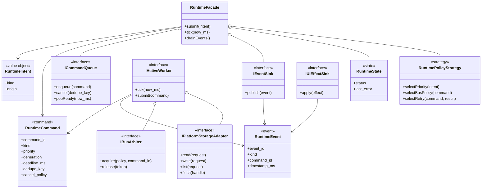

The important dependency direction is from stable runtime abstractions toward
ports. Platform adapters implement ports. Pages and widgets depend on facades or
presentation actions, not on adapters, workers, or concrete storage APIs.

## UML Component Boundary

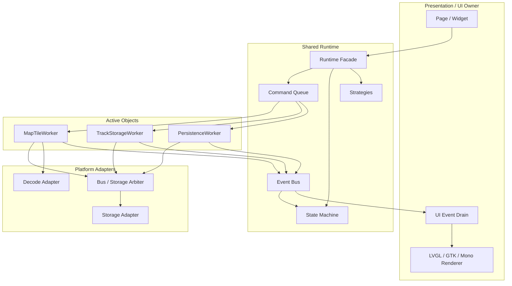

Forbidden reverse dependencies:

- platform adapter to page/widget
- worker to concrete renderer
- page/widget to storage adapter
- page/widget to shared-SPI lock
- adapter to product policy
- UI event drain to blocking worker execution

## UML Coverage Gate

Before coding an active-path migration, the design must include the following
views for the runtime area being changed:

| UML view | Required question it answers | Minimum content |
| --- | --- | --- |
| Business context | Which product actors and features participate? | user action, GPS/radio input, storage media, power/sleep, feedback |
| Bounded context | Which layer owns each concept? | presentation, runtime, worker, platform adapter, simulator |
| Static class model | What is the code skeleton shape? | intents, commands, events, state, policies, ports, adapters |
| Component dependency | Which dependencies are legal? | page to facade, facade to queue/state, worker to ports, event to UI drain |
| Thread/deployment | Which task/thread owns each operation? | UI owner, GPS task, radio task, worker tasks, storage/bus owner |
| State model | What long-running states exist? | command, storage health, tile, track, persistence, feedback |
| Sequence model | How does one scenario flow end-to-end? | success, timeout, cancellation, stale completion, page destruction |
| Simulation model | How is it tested without hardware? | fake clock, fake queue, fake storage, fake arbiter, fake UI drain |
| Legacy burn-down map | What old path is removed? | old active caller, new owner, deletion condition, guard test |

If one of these views is missing, the implementation is still in design debt and
must not proceed as a production migration.

## UML Business Context

This view shows the full product context for the UI/storage/event refactor.

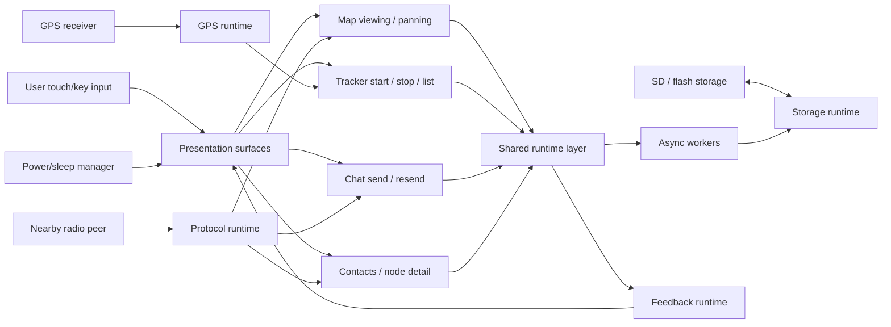

Business meaning:

- The user, GPS receiver, radio peer, storage media, and power manager are
  external stimuli.
- UI surfaces initiate product actions but do not own slow execution.
- Shared runtime owns business interpretation and state.
- Workers own slow operations.
- Feedback is global runtime output, not page-local rendering.

## UML Bounded Contexts

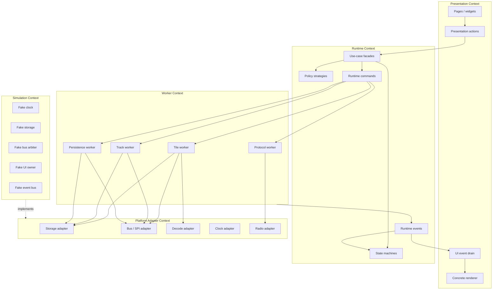

Boundary rules:

- Presentation may depend on runtime facades, not workers or adapters.
- Runtime may depend on ports and value objects, not concrete platform APIs.
- Workers may depend on platform ports, not pages or renderer objects.
- Platform adapters may depend on platform SDKs, not product policy.
- Simulation implements the same ports as platform adapters.

## UML Thread / Deployment View

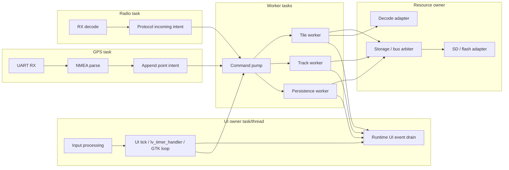

The UI owner task is never deployed as the resource owner. If a target has only
one physical thread, the same ownership model still applies cooperatively:
slow work must be incremental, budgeted, and represented as commands/events
rather than blocking UI execution.

When storage and display share a physical SPI domain, the storage worker is also
not the resource owner. It owns command state. A bus/storage scheduler owns
permission to occupy the display-shared resource and must apply wait, hold,
burst, and frame budgets.

## UML Bus Arbitration Class Model

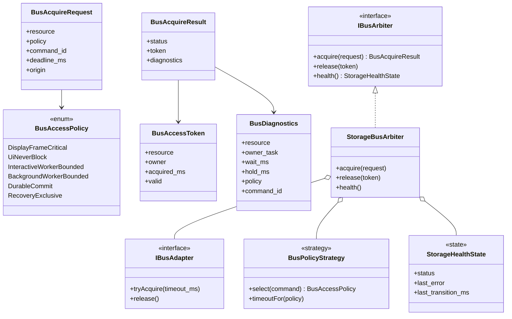

## UML Map Tile Class Model

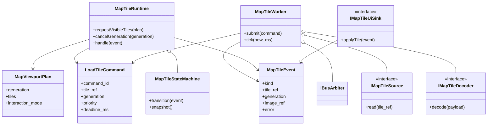

## UML Track Recording Class Model

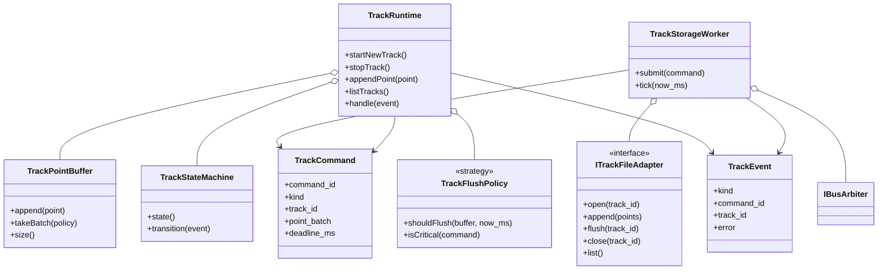

## UML Persistence Class Model

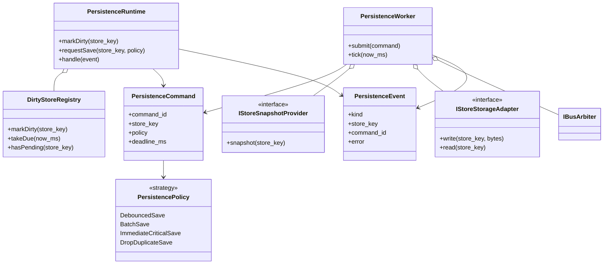

## UML Feedback Class Model

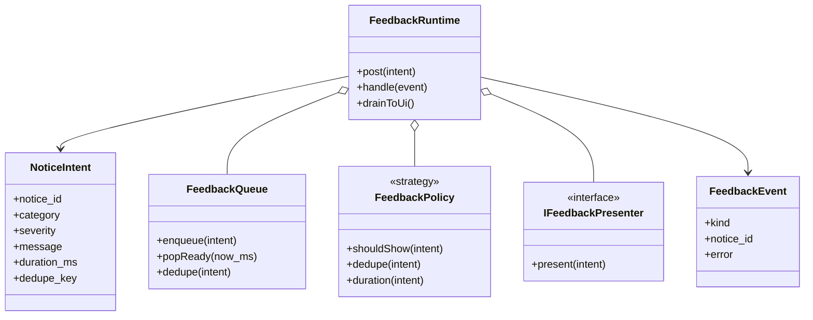

## UML State Models

### Command Lifecycle

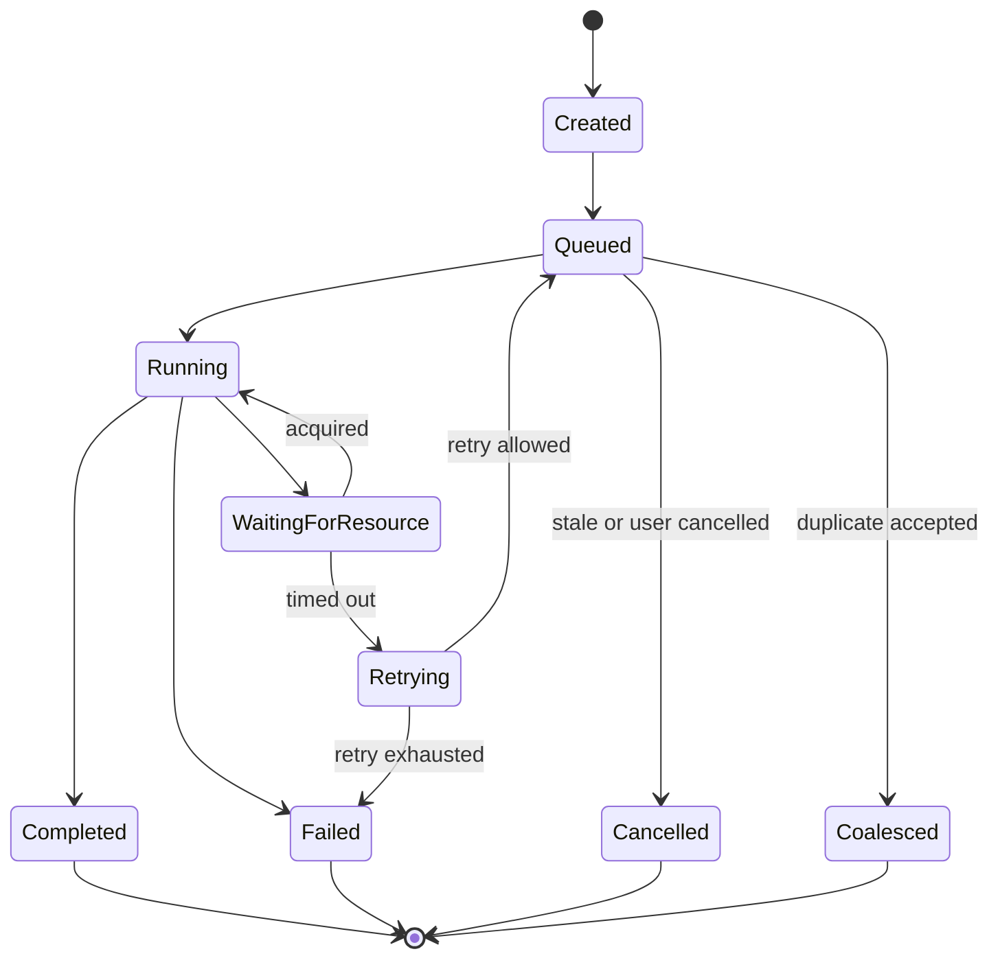

### Storage Health

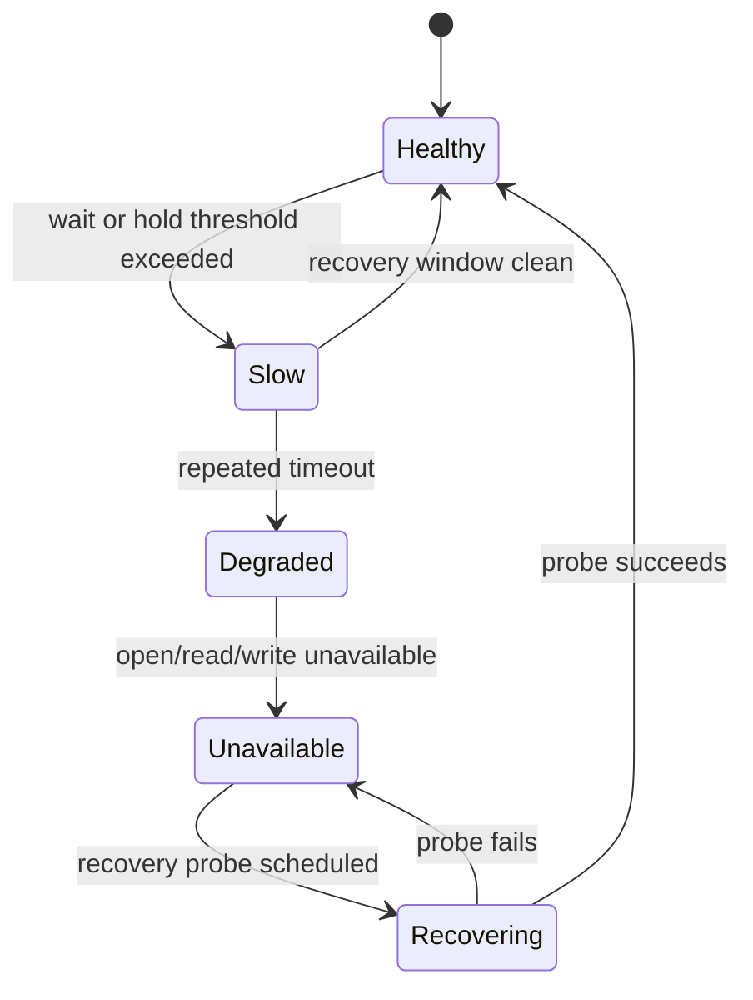

### Map Tile

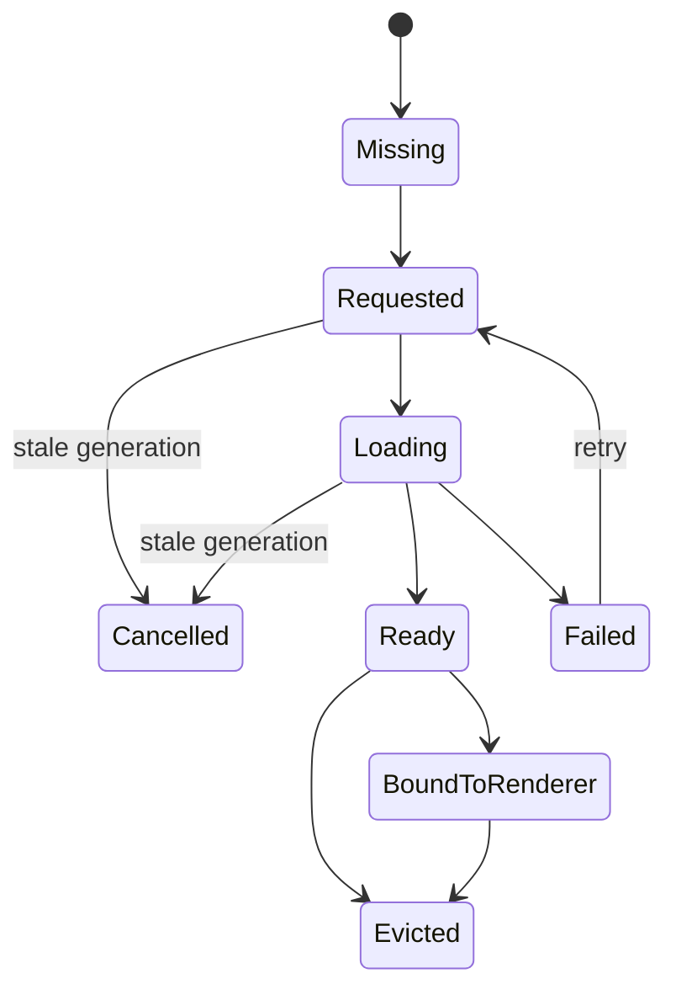

### Track Recorder

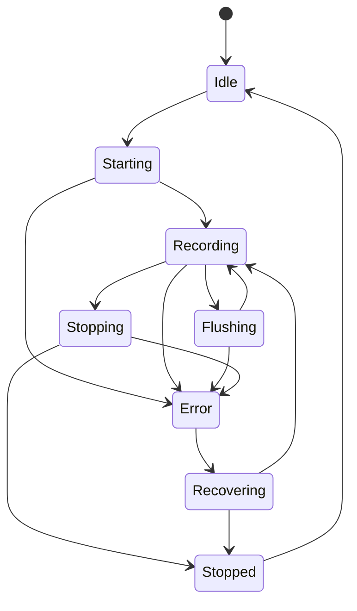

### Persistence Save

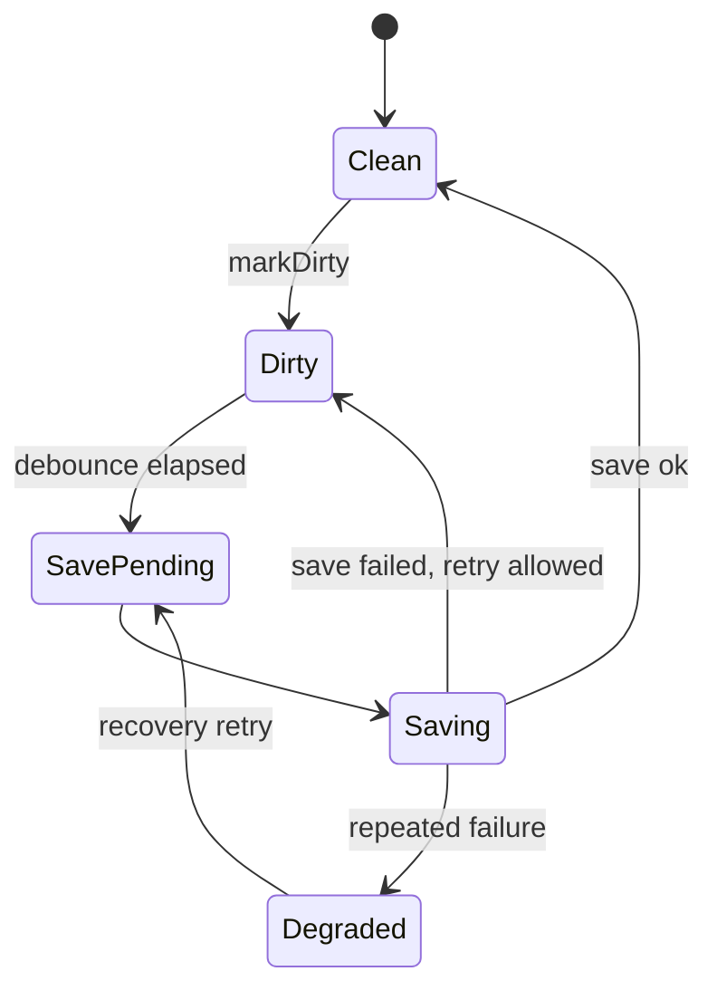

### Feedback Notice

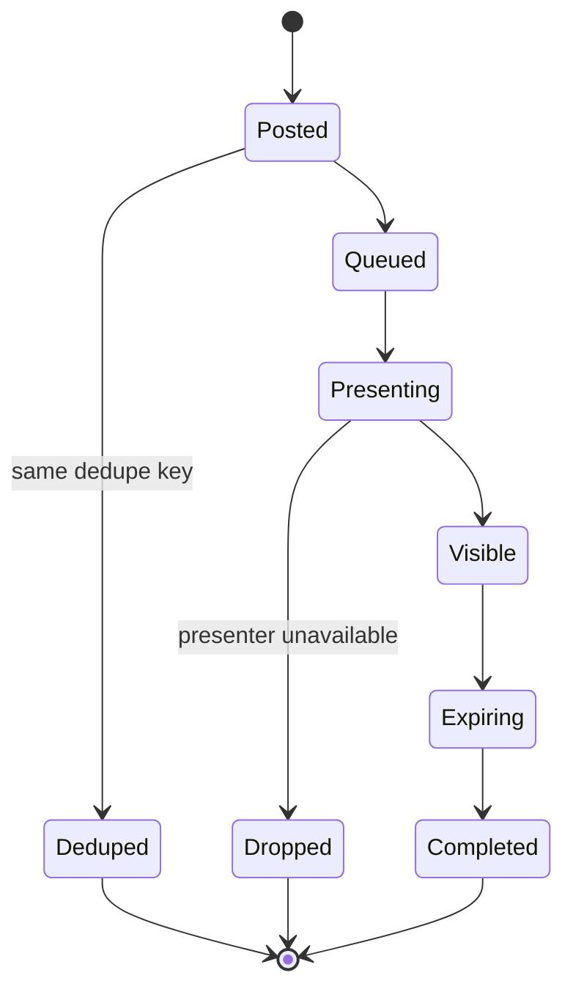

## UML Interaction Set

These sequences are required design coverage. They may be split into separate
documents during implementation, but each active-path migration must keep the
relevant sequence current.

### Mixed Map Drag and GPS Track Burst

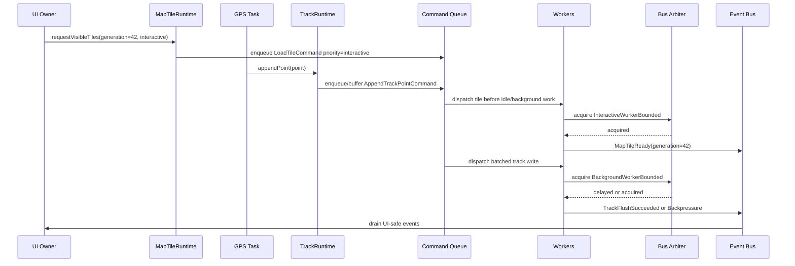

### NodeInfo Storm With Debounced Persistence

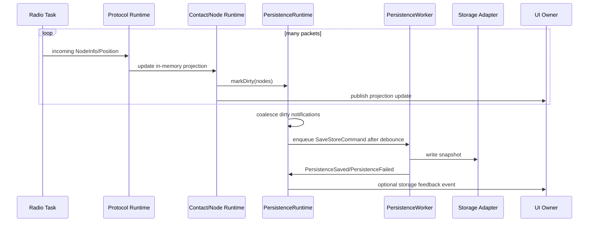

### Chat Send Result While Page Changes

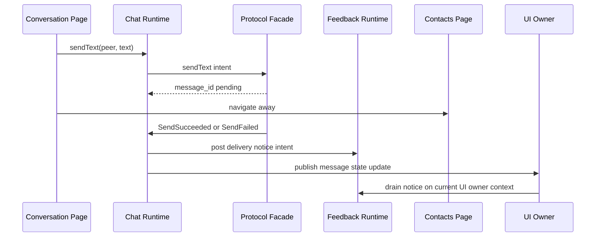

### Sleep / Wake While Storage Command Is Pending

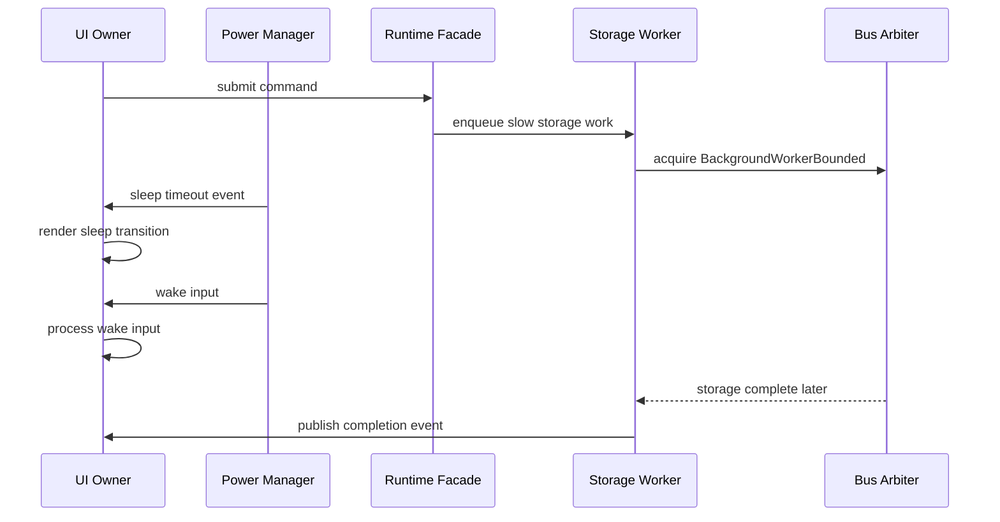

## UML Simulation Harness

```mermaid
classDiagram
  class RuntimeHarness {
    +advance(ms)
    +drainUi()
    +runUntilIdle()
  }

  class FakeClock {
    +now()
    +advance(ms)
  }

  class FakeCommandQueue {
    +enqueue(command)
    +popReady(now_ms)
    +size()
  }

  class FakeEventBus {
    +publish(event)
    +drain()
  }

  class FakeStorageBackend {
    +scriptDelay(operation, ms)
    +scriptFailure(operation, error)
    +read(request)
    +write(request)
  }

  class FakeBusArbiter {
    +scriptAcquire(result)
    +acquire(request)
    +diagnostics()
  }

  class FakeUiOwner {
    +assertNoBlockingCalls()
    +apply(effect)
    +tick()
  }

  class FakeFeedbackPresenter {
    +present(intent)
    +captured()
  }

  RuntimeHarness o-- FakeClock
  RuntimeHarness o-- FakeCommandQueue
  RuntimeHarness o-- FakeEventBus
  RuntimeHarness o-- FakeStorageBackend
  RuntimeHarness o-- FakeBusArbiter
  RuntimeHarness o-- FakeUiOwner
  RuntimeHarness o-- FakeFeedbackPresenter
```

The simulation harness is part of the design, not only test utility code. It
proves that runtime behavior is event-driven and not dependent on real SD,
SPI, LVGL, GTK, or radio hardware.

## Canonical Flow

```mermaid
flowchart LR
  Caller["UI / GPS / Protocol / App Service"] --> Intent["Runtime Intent"]
  Intent --> Facade["Runtime Facade"]
  Facade --> CommandQueue["Command Queue"]
  CommandQueue --> Worker["Active Object Worker"]
  Worker --> Arbiter["Storage / Bus Arbiter"]
  Arbiter --> Adapter["Platform Adapter"]
  Adapter --> Completion["Completion Result"]
  Completion --> EventBus["Event Bus"]
  EventBus --> State["Runtime State Projection"]
  EventBus --> UiDrain["UI Owner Event Drain"]
  UiDrain --> Renderer["Concrete Renderer Objects"]
```

The caller may be the UI owner context, GPS task, radio task, protocol runtime,
or app service. The rule is the same: submit intent or command, then return.

The UI event drain is the only step in this flow that may touch concrete UI
objects.

## Shared Resource Arbitration

Direct shared-SPI locking from feature code is legacy. The target design is a
bus/storage arbiter with explicit policies:

| Policy | Intended callers | Wait behavior | Failure behavior |
| --- | --- | --- | --- |
| `DisplayFrameCritical` | display flush, wake render, input-visible feedback | frame-budget bounded, highest priority | skip/defer non-critical storage |
| `UiNeverBlock` | UI event/timer/input paths | no wait or frame-budget-only try | defer, cancel, or render pending state |
| `InteractiveWorkerBounded` | map tile worker during drag | short bounded wait | cancel stale tile or retry later |
| `BackgroundWorkerBounded` | track append, node save, prefetch | bounded wait with backpressure | reschedule, batch, or enter degraded state |
| `DurableCommit` | explicit stop/close/final flush | bounded but higher priority | report durable failure event |
| `RecoveryExclusive` | storage remount or card recovery | exclusive, never from UI | publish degraded/unavailable state |

Every acquisition must be diagnosable:

```text
resource
owner_task_or_thread
command_id
wait_start_ms
acquired_ms
released_ms
hold_ms
wait_ms
policy
```

The arbiter expresses scheduling intent. A mutex only expresses exclusion. Code
that uses a bare blocking mutex to coordinate UI, SD, and display refresh is not
conformant.

For display-shared SPI, storage work must use a try-lock or bounded acquisition
and must enter cooldown/backpressure after every slow hold. The scheduler may
drop, defer, or mark commands `ResourceBusy`; it must not spin on the lock or
drain a burst of SD operations while display is trying to render.

## Map Tile Runtime Design

Map rendering must be split into request planning, slow tile work, and UI
application.

```mermaid
sequenceDiagram
  participant UI as UI Owner / MapViewport
  participant Runtime as MapTileRuntime
  participant Worker as MapTileWorker
  participant Store as Tile Storage Adapter
  participant Bus as Storage/Bus Arbiter
  participant Events as Event Bus

  UI->>Runtime: requestVisibleTiles(viewport, generation)
  Runtime->>Worker: enqueue LoadTileCommand(ref, generation, priority)
  UI-->>UI: return to input/render loop
  Worker->>Bus: acquire(policy)
  Bus-->>Worker: acquired or retry later
  Worker->>Store: read/decode tile payload
  Worker->>Events: MapTileReady/Failed(ref, generation, image_ref)
  Events->>UI: drain event on UI owner context
  UI->>UI: ignore stale generation or bind image to renderer object
```

Mandatory behavior:

- LVGL timers and input callbacks must not open tile files.
- LVGL timers and input callbacks must not wait for shared-SPI.
- Tile file lookup/read/decode must not be performed from drag, timer, input,
  or page render callbacks.
- Tile requests carry a viewport generation.
- Completion for stale generations must be ignored or released without UI work.
- Dragging uses interactive priority and cancels stale pending requests.
- Idle prefetch uses lower priority and must yield to current viewport tiles.
- Missing, loading, ready, failed, and cancelled are explicit tile states.
- Unknown tile availability is also state. The UI owner may render a pending or
  placeholder state, but it must not probe the SD card to discover whether a
  missing file exists.
- Negative tile probes must be cached or cooled down. Repeated `SD.open()` miss
  probes for adjacent tiles are forbidden in UI-visible paths.
- ESP active tile loading is not conforming until a slow/missing SD simulation
  proves UI ticks continue while storage work is deferred, marked busy, or
  completed later.

ESP active loader rules:

- `tile_loader_step()` is a UI owner path because it is reached from LVGL timers
  and map viewport callbacks.
- `tile_loader_step()` may calculate visible tile refs, move existing renderer
  objects, apply completed in-memory tile events, and submit/cancel runtime
  events.
- `tile_loader_step()` must not call `lv_fs_open`, SD file APIs, or a
  shared-SPI lock.
- The ESP worker adapter uses the SD runtime file adapter and acquires
  display-shared SPI only through the bus/storage scheduler. For visible tiles
  it must use try-lock or tightly bounded acquisition, publish `ResourceBusy`
  when the bus is not immediately available, and apply cooldown after any slow
  hold.
- `MapTileAsyncEvent` carries a copied `MapTilePayload` to the UI owner drain.
  The payload must be released even when stale.
- The ESP UI drain is non-blocking on command/event queues. A busy queue means
  the tile remains pending, not that the UI waits.
- The ESP UI drain applies at most one tile event per drain pass to avoid a
  burst of completed worker events monopolising the LVGL timer tick.

## Track Recording Runtime Design

Track recording must not perform durable storage in the GPS task or UI page
callback.

```mermaid
sequenceDiagram
  participant GPS as GPS Task
  participant UI as Tracker Page
  participant Runtime as TrackRuntime
  participant Worker as TrackStorageWorker
  participant Store as Track Storage Adapter
  participant Events as Event Bus

  UI->>Runtime: startNewTrack()
  Runtime->>Worker: enqueue StartTrackCommand
  UI-->>UI: render Starting state
  Worker->>Store: create/open file
  Worker->>Events: TrackStarted/TrackStartFailed
  Events->>UI: update page state

  GPS->>Runtime: appendPoint(point)
  Runtime->>Worker: enqueue/buffer point
  GPS-->>GPS: continue parsing
  Worker->>Store: batch write points
  Worker->>Events: TrackFlushSucceeded/Failed
```

Mandatory behavior:

- GPS parsing must not block on SD writes.
- UI actions such as New, Stop, Resume, List, Delete, and Export submit
  commands and render pending state.
- Track points are buffered and flushed by policy.
- `flush every point` is not allowed as the normal policy.
- Stop/close performs a durable final flush through a command completion event.
- The runtime state machine owns `Idle`, `Starting`, `Recording`, `Flushing`,
  `Stopping`, `Stopped`, `Error`, and `Recovering`.

## Persistence Runtime Design

Node/contact/config persistence must be decoupled from event dispatch.

```text
Runtime event updates in-memory state.
Persistence intent is recorded.
PersistenceWorker batches/debounces writes.
Persistence result is published as an event.
```

Required strategies:

- `DebouncedSave` for node/contact store updates.
- `ImmediateCriticalSave` only for explicit user settings or shutdown-critical
  state.
- `BatchSave` for high-frequency updates.
- `DropDuplicateSave` for repeated dirty notifications while one save is
  already pending.

Event dispatch may mark a store dirty. It must not synchronously write storage
from the UI owner context.

## Feedback Runtime Design

Feedback is an event-driven runtime concern.

```text
Feature/runtime detects a user-visible fact
  -> publishes feedback intent or domain completion event
  -> FeedbackRuntime applies eligibility/dedup policy
  -> UI owner event drain presents through platform presenter
```

Pages may request feedback, but pages do not own global feedback delivery.
Protocol completion, chat send result, storage degraded state, and tracker
failure events must be able to produce feedback regardless of the current page.

## State Machines

State machines must replace hidden call-stack state for cross-time flows.

### Storage Health

```text
Healthy -> Slow -> Degraded -> Unavailable
Unavailable -> Recovering -> Healthy
```

Entering `Slow`, `Degraded`, or `Unavailable` publishes an event. UI can show
reduced functionality without blocking.

### Map Tile

```text
Missing -> Requested -> Loading -> Ready -> BoundToRenderer
Requested -> Cancelled
Loading -> Cancelled
Loading -> Failed
Ready -> Evicted
```

### Track Recorder

```text
Idle -> Starting -> Recording -> Flushing -> Stopping -> Stopped
Recording -> Error
Error -> Recovering -> Recording
Error -> Stopped
```

### Chat Send Feedback

```text
Queued -> SubmittedToRadio -> ObservedAck -> Succeeded
SubmittedToRadio -> Timeout -> Failed
SubmittedToRadio -> Rejected -> Failed
```

The feedback runtime observes facts from this state machine. It does not infer
delivery success from the current page.

## Event Simulation and Robustness Testing

The refactor is not complete until runtime behavior can be simulated without
real hardware. The test harness must be able to drive events, command queues,
worker completions, delays, failures, and UI drains deterministically.

### Simulator Components

The simulator must provide:

| Component | Responsibility |
| --- | --- |
| `FakeClock` | deterministic time, timers, deadlines |
| `FakeUiThread` | records UI ticks and asserts no blocking operation runs on UI |
| `FakeEventBus` | publishes and drains runtime events deterministically |
| `FakeCommandQueue` | bounded queue, priorities, cancellation, dedupe |
| `FakeStorageBackend` | scripted read/write/list/flush delay and failure |
| `FakeBusArbiter` | scripted acquisition delay, timeout, owner diagnostics |
| `FakeMapTileWorker` | completes tile commands in controlled order |
| `FakeTrackStorageWorker` | batches points and emits track events |
| `FakeFeedbackPresenter` | captures notices without concrete renderer objects |

The same simulator style should be usable by unit tests for ESP-shared runtime
code and host/linux tests.

### Required Scenarios

#### Map Drag Under Slow SD

Script:

```text
UI requests viewport generation 1.
Storage delays tile reads by 200 ms.
UI requests viewport generation 2 before generation 1 completes.
Generation 1 completes after generation 2 is active.
```

Assertions:

- UI ticks continue.
- No UI-side blocking storage call occurs.
- Generation 1 results are ignored or released.
- Generation 2 visible tiles are applied when ready.
- Queue does not grow without bound.

#### GPS Track Burst While Map Is Dragging

Script:

```text
Generate 100 GPS points.
Generate map drag requests every frame.
Make storage arbiter slow for 2 seconds.
```

Assertions:

- GPS producer returns without waiting for SD.
- Track writer batches points.
- Map interactive requests keep higher priority than idle prefetch.
- UI event drain remains responsive.
- Backpressure is reported instead of freezing.

#### Tracker New / Stop / List While Storage Busy

Script:

```text
Hold storage busy.
Click New.
Click Back or navigate away.
Release storage.
Complete StartTrackCommand.
Request listTracks.
```

Assertions:

- UI renders pending state and remains navigable.
- Completion does not dereference destroyed page objects.
- Track runtime state is correct after navigation.
- List results are delivered through events.

#### NodeInfo / Position Storm

Script:

```text
Publish many NodeInfo and Position events.
Mark node/contact store dirty repeatedly.
Advance fake time under debounce threshold.
Advance past threshold.
```

Assertions:

- Memory projection updates are visible.
- Persistence writes are debounced and deduplicated.
- UI dispatch does not perform synchronous storage writes.
- Save failure produces a storage event and optional feedback intent.

#### Chat Send Result From Any Page

Script:

```text
Send chat message from conversation page.
Navigate to contacts page.
Deliver ack timeout or success event.
```

Assertions:

- The original message is updated, not duplicated.
- Feedback notice is captured by feedback runtime.
- Notice does not depend on current page.
- No page-owned `SystemNotification` call is required.

#### Sleep / Wake During Pending Storage

Script:

```text
Start long storage command.
Trigger screen sleep timer.
Inject wake input.
Complete storage command.
```

Assertions:

- Wake input is processed by UI owner context.
- Pending storage does not block wake path.
- UI state after completion is consistent.

#### Storage Circuit Breaker

Script:

```text
Make storage time out repeatedly.
Submit tile, track, and persistence commands.
Advance clock through retry windows.
Recover storage.
```

Assertions:

- Storage health transitions to Slow/Degraded/Unavailable.
- UI receives degraded state without freezing.
- Non-critical work is dropped, cancelled, or delayed by policy.
- Critical durable commands report failure or recover explicitly.

### Test Invariants

All runtime tests must assert:

- UI owner context does not call blocking storage, blocking shared-SPI, or
  filesystem APIs.
- Background workers do not call concrete renderer APIs.
- Every command completes, fails, is cancelled, or remains pending for an
  explained reason.
- Queue bounds are enforced.
- Stale map tile generations cannot mutate the current viewport.
- Store saves are batched or debounced when high-frequency events arrive.
- Feedback capture does not require a live page object.
- Resource owner, wait time, and hold time diagnostics are emitted for slow
  storage/bus operations.

## Migration Order

The burn-down should proceed in slices that each leave the system shippable.

1. Add diagnostics around UI tick, storage/bus wait, command enqueue, command
   completion, and event drain.
2. Introduce command/event simulator tests for feedback and chat send result.
3. Move map tile file access out of LVGL timer/input paths.
4. Move track start/stop/list/append/flush into an asynchronous track storage
   worker.
5. Move node/contact persistence to a debounced persistence worker.
6. Replace direct shared-SPI lock calls in UI-facing code with arbiter policies.
7. Burn down adapter-owned business decisions and route them through shared
   runtimes/facades.
8. Turn remaining synchronous storage calls in page/widget code into compile or
   test failures.

## Conformance Checklist

A change conforms to this design only when:

- UI code submits commands or intents instead of executing slow work.
- Slow work has an owning worker or declared active object.
- Cross-context results are events.
- UI mutation happens only in the UI owner drain.
- Platform adapters contain no business policy.
- Shared resource access is policy-driven and diagnosable.
- State machines describe visible long-running operation state.
- Simulation tests can trigger success, failure, timeout, cancellation,
  backpressure, and stale completion.
- The same business rule is implemented once in runtime code and reused by
  ESP32, nRF52, Linux LVGL, and Linux GTK targets through bridges/adapters.
