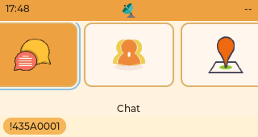
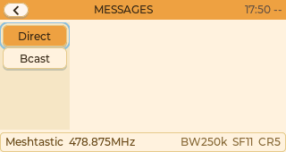
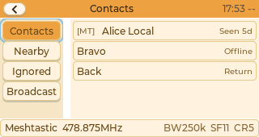
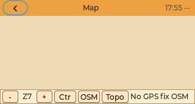
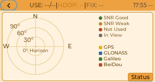
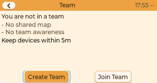
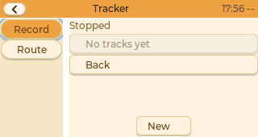
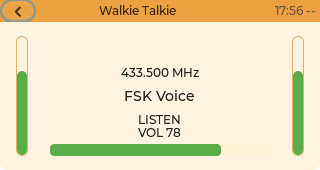
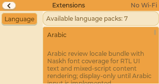
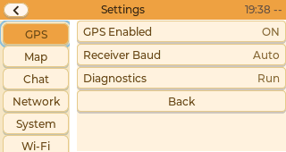

# Cardputer Zero Screenshot Evidence

This document records the current Cardputer Zero page screenshots captured from
the shared LVGL Cardputer compact UI path. These images are evidence from the
real Trail Mate shell route; they are not mockups, generated drawings, or a new
Linux-panel design direction.

## Capture Path

The screenshots are produced by:

```text
apps/linux_cardputer_zero/tools/cardputer_zero_screenshot_capture.cpp
  -> ShellSession
  -> CanvasLvglHost
  -> shared LVGL shell
  -> cardputer_compact UX pack
  -> make_cardputer_zero_profile()
```

The app shell sets the Cardputer Zero compact UX pack, and the LVGL host renders
to a 320 x 170 canvas before encoding PNG output.

## Capture Command

From WSL at the repository root:

```bash
cd builds/linux_cmake
cmake --build --preset linux-cardputer-zero-debug-build

cd /mnt/c/Users/VicLi/Documents/Projects/trail-mate
rm -f docs/images/cardputerzero/screenshots/*.png
for target in dashboard chat contacts map sky_plot team tracker walkie extensions settings; do
  timeout 40s env TRAIL_MATE_LORA_DISABLE=1 \
    builds/linux_cmake/build/linux-cardputer-zero-debug/apps/linux_cardputer_zero/trailmate_linux_cardputer_zero_screenshot_capture \
    /mnt/c/Users/VicLi/Documents/Projects/trail-mate/docs/images/cardputerzero/screenshots \
    "$target" || exit $?
done
```

From PowerShell, pass each target explicitly so `$target` is not expanded before
the WSL shell receives it:

```powershell
$targets = @(
  'dashboard',
  'chat',
  'contacts',
  'map',
  'sky_plot',
  'team',
  'tracker',
  'walkie',
  'extensions',
  'settings'
)
wsl bash -lc 'cd /mnt/c/Users/VicLi/Documents/Projects/trail-mate && rm -f docs/images/cardputerzero/screenshots/*.png'
foreach ($target in $targets) {
  wsl bash -lc "cd /mnt/c/Users/VicLi/Documents/Projects/trail-mate && timeout 40s env TRAIL_MATE_LORA_DISABLE=1 builds/linux_cmake/build/linux-cardputer-zero-debug/apps/linux_cardputer_zero/trailmate_linux_cardputer_zero_screenshot_capture /mnt/c/Users/VicLi/Documents/Projects/trail-mate/docs/images/cardputerzero/screenshots $target"
  if ($LASTEXITCODE -ne 0) { exit $LASTEXITCODE }
}
```

`TRAIL_MATE_LORA_DISABLE=1` is used so screenshot capture does not depend on a
live SX1262 endpoint. It does not change the UI route being rendered.

## Screenshot Matrix

| Page | Evidence | Notes |
| --- | --- | --- |
| Dashboard | `docs/images/cardputerzero/screenshots/dashboard.png` | Shared Cardputer compact menu/dashboard frame. |
| Chat | `docs/images/cardputerzero/screenshots/chat.png` | Real shared chat page reached from the compact menu. |
| Contacts | `docs/images/cardputerzero/screenshots/contacts.png` | Real shared contacts page reached from the compact menu. |
| Map | `docs/images/cardputerzero/screenshots/map.png` | Real shared map page reached from the compact menu. It exposes compact zoom, center, base-layer, and contour controls and must not be seeded with product-path mock coordinates. |
| Sky Plot | `docs/images/cardputerzero/screenshots/sky-plot.png` | Real shared GNSS sky-plot page reached from the compact menu with the Cardputer Zero dense geometry. |
| Team | `docs/images/cardputerzero/screenshots/team.png` | Real shared team page reached from the compact menu. |
| Tracker | `docs/images/cardputerzero/screenshots/tracker.png` | Real shared tracker page reached from the compact menu. |
| Walkie Talkie | `docs/images/cardputerzero/screenshots/walkie.png` | Real shared walkie-talkie page reached from the compact menu. |
| Extensions | `docs/images/cardputerzero/screenshots/extensions.png` | Real shared extensions page reached from the compact menu. |
| Settings | `docs/images/cardputerzero/screenshots/settings.png` | Real shared settings page reached from the compact menu. |

Excluded Cardputer Zero product entries: PC Link, SSTV, Energy Sweep /
Spectrum, and SD Storage / USB Disk. SD Storage is the card-access/USB
mass-storage feature and is distinct from Extensions, which remains part of the
Cardputer Zero product menu.

All generated PNGs have been checked as 320 x 170 images.

## Visual Observations

The current evidence proves that each compact route can be reached and rendered
from the Cardputer Zero shared LVGL path. It also exposes page-adaptation work
that should stay visible:

- Dashboard now captures the Pager-derived compact menu after the boot splash
  gate instead of the splash overlay.
- Contacts now uses the dense fixed protocol/name/status row layout on the 320 x
  170 viewport; the first-contact text overlap shown in the initial screenshot
  evidence has been removed.
- Chat, Settings, Tracker, and Team now consume the first dense page-profile
  slice for top bars, side filters, list rows, controls, value columns, and the
  air status footer. Chat conversation bubbles still need message-populated
  screenshot validation.
- Map and Sky Plot now render distinct projections. Map uses the runtime map
  workspace source/sink and exposes compact operation controls for zoom,
  center-on-self, base-layer cycling, and contour toggling; Sky Plot uses the
  GNSS sky-plot runtime page.
- Sky Plot now uses Cardputer Zero dense geometry so the sky panel bottom,
  constellation legend, status overlay, and Status toggle fit within the 320 x
  170 screenshot without lower-edge clipping.
- Map tile imagery is absent in this host capture because no tile cache is
  available in the capture environment. The screenshot should therefore show
  the live no-fix/no-tile state and controls, not product-path mock map data.
- Chat, Team, Tracker, and Settings render as reachable shared pages, but still
  need hardware-session interaction checks before being treated as final
  Cardputer Zero page closure.

## Images

### Dashboard



### Chat



### Contacts



### Map



### Sky Plot



### Team



### Tracker



### Walkie Talkie



### Extensions



### Settings



## Current Caveats

- These screenshots validate the shared LVGL Cardputer compact UI path, not the
  physical Cardputer Zero framebuffer handoff.
- Real hardware evdev keyboard mapping still needs device-session validation.
- Fcitx5 text commit and notifyd D-Bus behavior still need live Cardputer Zero
  session validation.
- Map tile imagery is only visible when the host-side tile cache is populated or
  the Linux online tile cache can fetch it. Cardputer Zero product runtime must
  not use mock/default coordinates to make Map look populated.
- The current compact shell exposes distinct Map and Sky Plot route ids. Sky
  Plot should show the GNSS sky-plot page rather than the map workspace.
- The capture helper exits each single-page capture process immediately after
  encoding the PNG to avoid current LVGL teardown instability in the evidence
  tool. Product runtime does not use that exit path.
